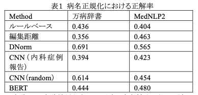

# DNorm-J

## 概要

日本語の病名を正規化するツールです

## 手法

[DNorm](https://www.ncbi.nlm.nih.gov/pmc/articles/PMC3810844/)の日本語実装になります．  
Tf-idf ベースのランキング手法により病名を正規化します。

詳細はリンク先の論文をご参照ください．

## 環境

- python >= 3.6.1
- MeCab >= 0.996.5
- IPA 辞書

## インストール

```
pip install git+https://github.com/sociocom/DNorm-J.git
```

## 使い方

ターミナルなどの端末アプリでコマンドラインアプリケーションとして使えるほか，Python スクリプト内でライブラリとして導入することが可能です．

いずれの使い方でも，初回に学習済みモデルファイルをローカル（`$HOME/.cache/Dnorm`）にダウンロードします．
そのため，初回起動には時間がかかります．

### コマンドラインからの利用

- -i：入力ファイル
- -o：出力ファイル
- -n：正規化先の病名リスト（デフォルト設定では指定する必要はありません）
- -d：略語展開辞書（デフォルト設定では指定する必要はありません）

`python -m dnorm_j -i sample.txt -o output.txt`

#### 入力（sample.txt）

```
腸閉塞症状
高Ｃａ尿症
二次性副腎不全
```

#### 出力（output.txt）

```
イレウス
高カルシウム尿症
副腎クリーゼ
```

### ライブラリとしての利用

```python
from dnorm_j import DNorm

model = DNorm.from_pretrained()
result = model.normalize('AML')
print(result)  # => '急性骨髄性白血病'
```

## 性能



## コントリビュータ

- 氏家翔吾（奈良先端科学技術大学院大学）
